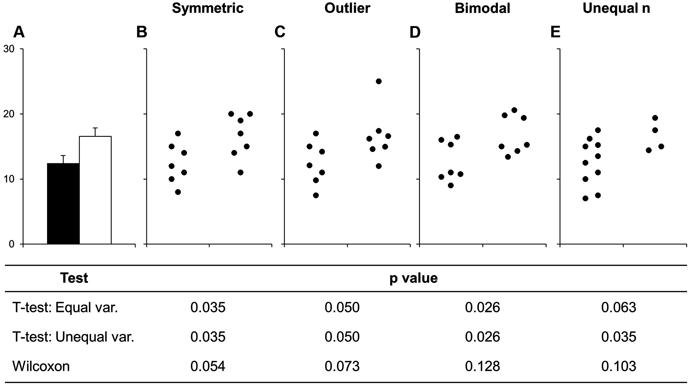
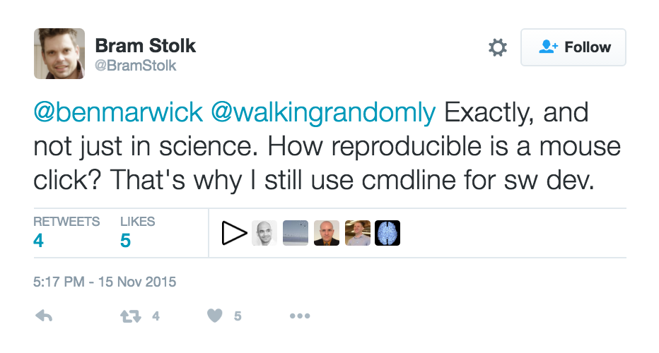

```{r setup, include=FALSE}
knitr::opts_chunk$set(echo = TRUE)
library(ggplot2)
library(gridExtra)
library(dplyr)
library(tidyr)
colors <- c("#779977", "#E69F00", "#56B4E9", "#009E73", "#F0E442", "#0072B2", "#D55E00", "#CC79A7", "#CCCCCC")
```

## Use and License

Recording of this talk, taking photos, discussing the content using email, Twitter, blogs, etc. is permitted (and encouraged), 
providing distraction to others during the presentation is minimised.

These slides and source code are available on GitHub: [https://widdowquinn.github.io/Presentation-DataVis-Barplots](https://widdowquinn.github.io/Presentation-DataVis-Barplots/#/)

These slides are made available under [CC-BY v4.0](https://creativecommons.org/licenses/by/4.0/)

## IMAGINE...

> - YOUR FIGURES ARE AMAZING!
> - BUT MISLEADING

# A bar chart

## Two effectors

- Knocked out independently
- Host chlorosis measured

## Communication

- Stories told through figures

```{r Fig:MisleadBar, echo=FALSE, fig.width=5, fig.height=5}

mean = c(9.5, 9.75)
sd = c(.25, .25)
key = c("AvrX", "AvrY")

misleading_data_bar = data.frame(mean, sd, key)
misleading_data_bar$sd_min = mean - sd
misleading_data_bar$sd_max = mean + sd
  
data.barplot1 = ggplot(misleading_data_bar, aes(x = key, y = mean)) +
  geom_bar(stat = "identity", aes(fill = key, alpha = .5)) +
  #geom_errorbar(aes(ymin = sd_min, ymax = sd_max), width = 0.25, lwd=1) +
  coord_cartesian(ylim=c(9.25, 10), expand = FALSE) +
  scale_fill_manual(values = c(colors[[1]], colors[[6]])) +
  xlab("") +
  ylab("Chlorosis") +
  theme_classic() +
  theme(axis.line.y = element_line(), legend.position = "none", legend.key = element_blank(),
        text=element_text(size=24), panel.grid.major = element_blank(), panel.grid.minor = element_blank(),
        legend.title = element_blank(), axis.text.y = element_blank())

data.barplot1
```

## Scales matter

- Indication of quantities

```{r Fig:MisleadBar2, echo=FALSE, fig.width=5, fig.height=5}

data.barplot2 = ggplot(misleading_data_bar, aes(x = key, y = mean)) +
  geom_bar(stat = "identity", aes(fill = key, alpha = .5)) +
  #geom_errorbar(aes(ymin = sd_min, ymax = sd_max), width = 0.25, lwd=1) +
  coord_cartesian(ylim=c(9.25, 10), expand = FALSE) +
  scale_fill_manual(values = c(colors[[1]], colors[[6]])) +
  xlab("") +
  ylab("Chlorosis") +
  theme_classic() +
  theme(axis.line.y = element_line(), legend.position = "none", legend.key = element_blank(),
        text=element_text(size=24), panel.grid.major = element_blank(), panel.grid.minor = element_blank(),
        legend.title = element_blank())

data.barplot2
```

## Context matters

- The same or not the same?

```{r Fig:MisleadBar3, echo=FALSE, fig.width=5, fig.height=5}

data.barplot3 = ggplot(misleading_data_bar, aes(x = key, y = mean)) +
  geom_bar(stat = "identity", aes(fill = key, alpha = .5)) +
  #geom_errorbar(aes(ymin = sd_min, ymax = sd_max), width = 0.25, lwd=1) +
  coord_cartesian(ylim=c(0, 10.5), expand = FALSE) +
  scale_fill_manual(values = c(colors[[1]], colors[[6]])) +
  xlab("") +
  ylab("Chlorosis") +
  theme_classic() +
  theme(axis.line.y = element_line(), legend.position = "none", legend.key = element_blank(),
        text=element_text(size=24), panel.grid.major = element_blank(), panel.grid.minor = element_blank(),
        legend.title = element_blank())

data.barplot3
```

# Figures can mislead

## Storytelling

- Figures are what you remember of a 'story'

```{r Fig:MisleadBar4, echo=FALSE, fig.width=4, fig.height=4}
data.barplot1 +
  theme(axis.line.y = element_line(), legend.position = "none", legend.key = element_blank(),
        text=element_text(size=18), panel.grid.major = element_blank(), panel.grid.minor = element_blank(),
        legend.title = element_blank())
data.barplot3 +
  theme(axis.line.y = element_line(), legend.position = "none", legend.key = element_blank(),
        text=element_text(size=18), panel.grid.major = element_blank(), panel.grid.minor = element_blank(),
        legend.title = element_blank())
```

- What about *uncertainty*?

# Another Bar Chart

## Four effectors

- Bacterial effectors
- Inoculate wild-type plants
- Measure growth (CFU)

## Four bar plots

- Do the effectors have the same effect?

```{r Fig:WeissgerberBar, echo=FALSE, fig.width=7, fig.height=5}
#These data are constructed based on data kindly shared by Tracy Weissgerber to reconstruct and play with different datasets which have the same mean. The original figure and the paper, along with follow-up work, can be found in this presentation in upcoming slides.
HopItyA = c(1.1, 4, 7, 9, 12, 11, 4.6, 6.9, 5.5, 6.35, 7.05)
HopItyC = c(4.6, 4.95, 6.2, 6.0, 15.8, 3.3, 5.9, NA, NA, NA, NA)
HopItyD = c(4.2, 4.4, 3.75, 3.85, 10, 10.2, 10.4, NA, NA, NA, NA)
HopItyB = c(9.5, NA, 3.15, 7.5, NA, NA, NA, NA, NA, NA, NA)

data.c = data.frame(HopItyA, HopItyB, HopItyC, HopItyD)

data = na.omit(gather(data.c))

data_bar = data %>%
  group_by(key) %>%
  summarise(mean = mean(value),
            sd = sd(value)) %>%
  ungroup() %>%
  mutate(sd_min = mean - sd) %>%
  mutate(sd_max = mean + sd) %>%
  mutate(n = c(11, 3, 7, 7)) %>%
  mutate(sem = sd/sqrt(n)) %>%
  mutate(sem_min = mean - sem) %>%
  mutate(sem_max = mean + sem)

data.barplot4 = ggplot(data_bar, aes(x = key, y = mean)) +
  geom_bar(stat = "identity", aes(fill = key, alpha = .5)) +
  #geom_errorbar(aes(ymin = sd_min, ymax = sd_max), width = 0.25, lwd=1) +
  coord_cartesian(ylim=c(0,16), expand = FALSE) +
  scale_fill_manual(values = c(colors[[6]], colors[[7]], colors[[8]], colors[[1]])) +
  xlab("") +
  ylab("log CFU") +
  theme_classic() +
  theme(axis.line.y = element_line(), legend.position = "none", legend.key = element_blank(),
        text=element_text(size=24), panel.grid.major = element_blank(), panel.grid.minor = element_blank(),
        legend.title = element_blank())

data.barplot4
```

## Add error bars

- Do the effectors have the same effect?

```{r Fig:WeissgerberBar2, echo=FALSE, fig.width=7, fig.height=5}
data.barplot5 = ggplot(data_bar, aes(x = key, y = mean)) +
  geom_bar(stat = "identity", aes(fill = key, alpha = .5)) +
  geom_errorbar(aes(ymin = sd_min, ymax = sd_max), width = 0.25, lwd=1) +
  coord_cartesian(ylim=c(0,16), expand = FALSE) +
  scale_fill_manual(values = c(colors[[6]], colors[[7]], colors[[8]], colors[[1]])) +
  xlab("") +
  ylab("log CFU") +
  theme_classic() +
  theme(axis.line.y = element_line(), legend.position = "none", legend.key = element_blank(),
        text=element_text(size=24), panel.grid.major = element_blank(), panel.grid.minor = element_blank(),
        legend.title = element_blank())

data.barplot5
```

# Error bars

## Error bars

> - Estimates of uncertainty
> - But uncertainty of what?
> - **standard deviation** (*sd*): 
>     - describes the data: *how much members of the group differ from the mean*
> - **standard error (of the mean)** (*sem*):
>     - describes the estimate of the mean: *standard deviation of the estimate of the mean*

## SD or SEM?

- Which was used (& which do you need to know)?

```{r Fig:WeissgerberBar2b, echo=FALSE, fig.width=5, fig.height=4}
data.barplot5a = ggplot(data_bar, aes(x = key, y = mean)) +
  geom_bar(stat = "identity", aes(fill = key, alpha = .5)) +
  geom_errorbar(aes(ymin = sem_min, ymax = sem_max), width = 0.25, lwd=1) +
  coord_cartesian(ylim=c(0,16), expand = FALSE) +
  scale_fill_manual(values = c(colors[[6]], colors[[7]], colors[[8]], colors[[1]])) +
  xlab("") +
  ylab("log CFU") +
  theme_classic() +
  theme(axis.line.y = element_line(), legend.position = "none", legend.key = element_blank(),
        text=element_text(size=16), panel.grid.major = element_blank(), panel.grid.minor = element_blank(),
        legend.title = element_blank())

data.barplot5 +
  theme(axis.line.y = element_line(), legend.position = "none", legend.key = element_blank(),
        text=element_text(size=16), panel.grid.major = element_blank(), panel.grid.minor = element_blank(),
        legend.title = element_blank())
data.barplot5a
```

# Raw data

## Raw data

- Are they the same biological responses?

```{r Fig:WeissgerberRaw, echo=FALSE, fig.width=7, fig.height=5}
data.raw1 = ggplot(data, aes(x=key, y=value, colour=key)) +
  #geom_violin(aes(fill = key)) +
  geom_jitter(width = .2, height = 0, size = 2.5) +
  scale_y_continuous(limits = c(0, 16), expand = c(0,0)) +
  scale_colour_manual(values = c(colors[[6]], colors[[7]], colors[[8]], colors[[1]])) +
  xlab("") +
  ylab("log CFU") +
  theme_classic() +
  theme(axis.line.y = element_line(), legend.position = "none", legend.key = element_blank(),
        text=element_text(size=24), panel.grid.major = element_blank(), panel.grid.minor = element_blank(),
        legend.title = element_blank())

data.raw1
```

## What does mean mean?

- Same mean implies the same response?

```{r Fig:WeissgerberMeanRaw, echo=FALSE, fig.width=7, fig.height=5}
data.raw2 = ggplot(data, aes(x = key, y = value, colour = key)) +
  #geom_violin(aes(fill = key)) +
  geom_jitter(width = .2, height = 0, size = 2.5) +
  geom_point(data=data_bar, aes(x = key, y = mean), shape = 95, size = 24) +
  scale_y_continuous(limits = c(0, 16), expand = c(0,0)) +
  scale_colour_manual(values = c(colors[[6]], colors[[7]], colors[[8]], colors[[1]])) +
  xlab("") +
  ylab("log CFU") +
  theme_classic() +
  theme(axis.line.y = element_line(), legend.position = "none", legend.key = element_blank(),
        text=element_text(size=24), panel.grid.major = element_blank(), panel.grid.minor = element_blank(),
        legend.title = element_blank())


data.raw2
```

## What does mean mean?

- Unequal sample sizes (*cf*. barplot)

```{r Fig:WeissgerberMeanRawA, echo=FALSE, fig.width=7, fig.height=5}
data.raw2a = ggplot(data, aes(x = key, y = value, colour = key)) +
  #geom_violin(aes(fill = key)) +
  geom_jitter(width = .2, height = 0, size = 2.5) +
  geom_point(data=data_bar, aes(x = key, y = mean), shape = 95, size = 24) +
  scale_y_continuous(limits = c(0, 16), expand = c(0,0)) +
  scale_colour_manual(values = c(colors[[6]], colors[[7]], colors[[9]], colors[[9]])) +
  xlab("") +
  ylab("log CFU") +
  theme_classic() +
  theme(axis.line.y = element_line(), legend.position = "none", legend.key = element_blank(),
        text=element_text(size=24), panel.grid.major = element_blank(), panel.grid.minor = element_blank(),
        legend.title = element_blank())


data.raw2a
```

## What does mean mean?

- Outliers (*cf*. barplot)

```{r Fig:WeissgerberMeanRawB, echo=FALSE, fig.width=7, fig.height=5}
data.raw2b = ggplot(data, aes(x = key, y = value, colour = key)) +
  #geom_violin(aes(fill = key)) +
  geom_jitter(width = .2, height = 0, size = 2.5) +
  geom_point(data=data_bar, aes(x = key, y = mean), shape = 95, size = 24) +
  scale_y_continuous(limits = c(0, 16), expand = c(0,0)) +
  scale_colour_manual(values = c(colors[[6]], colors[[9]], colors[[8]], colors[[9]])) +
  xlab("") +
  ylab("log CFU") +
  theme_classic() +
  theme(axis.line.y = element_line(), legend.position = "none", legend.key = element_blank(),
        text=element_text(size=24), panel.grid.major = element_blank(), panel.grid.minor = element_blank(),
        legend.title = element_blank())


data.raw2b
```

## What does mean mean?

- Bimodal distribution (*cf*. barplot)

```{r Fig:WeissgerberMeanRawC, echo=FALSE, fig.width=7, fig.height=5}
data.raw2c = ggplot(data, aes(x = key, y = value, colour = key)) +
  #geom_violin(aes(fill = key)) +
  geom_jitter(width = .2, height = 0, size = 2.5) +
  geom_point(data=data_bar, aes(x = key, y = mean), shape = 95, size = 24) +
  scale_y_continuous(limits = c(0, 16), expand = c(0,0)) +
  scale_colour_manual(values = c(colors[[6]], colors[[9]], colors[[9]], colors[[1]])) +
  xlab("") +
  ylab("log CFU") +
  theme_classic() +
  theme(axis.line.y = element_line(), legend.position = "none", legend.key = element_blank(),
        text=element_text(size=24), panel.grid.major = element_blank(), panel.grid.minor = element_blank(),
        legend.title = element_blank())


data.raw2c
```

# But stats, right?

## We only use figures as guides…

> - "Figures tell a story, but we actually only believe the stats"
> - Typical paper:
>      - `P<0.05`, *t*-test (NHST), a description if you're lucky
> - Do the distributions support use of a *t*-test, e.g. assumptions for 2-sample *t*-test:
>     - both populations Normal
>     - equal standard deviations

## …we trust the P-values

- Bar plots can hide inappropriate assumptions



Source: [Weissgerber et al. (2015)](http://journals.plos.org/plosbiology/article?id=10.1371/journal.pbio.1002128)

## Figures can mislead

> - reinforce poor practice
>     - binary thinking
>     - overlooking data distributions and wrong statistical assumptions for tests
>     - overlooking uncertainty
> - suggest *neat* stories (`P<0.05`)
>     - data, like life, can be *messy*

# Ways forward

## Your analysis?

> - **What you did…**
>     - Open package `foo`. Click. Click, drag. Click, Click. Undo. Click. Right-click. Save `results.csv`
>     - Load into `Excel`. Click, drag. Generate graph. Right-click. Save `pretty-graph.png`

## Your analysis?

> - **What you said you did in the paper…**
>     - I analysed my data in `foo` using the `bar` analysis. Results are shown in Figure 1.

## How reproducible is a mouse click?



## Reproducible research

> - Automate (i.e. learn to program)
> - Write code in a (very) high-level language
> - Get some training
> - Use version control
> - Get a code buddy
> - Share code and data openly
> - Write tests

## Now what? 

> - "Thanks for undermining me. Now what do I do about it?"
> - Other data representations are available ([`UseR!`](http://www.springer.com/series/6991))
> - Data visualisation/statistics/programming training courses
>     - [Research Data Visualisation Workshops](https://www.software.ac.uk/rdvw)
>     - [Data Carpentry](http://www.datacarpentry.org/)
>     - [Software Carpentry](http://software-carpentry.org/)

# Other visualisations

## Anscombe's Quartet

- Four datasets: same means and standard deviations

```{r Fig:AnscombeBar, echo=FALSE, fig.width=7, fig.height=4}
anscombe_summary = gather(anscombe)
  
data_bar = anscombe_summary[45:88,] %>%
  group_by(key) %>%
  summarise(mean = mean(value),
            sd = sd(value)) %>%
  ungroup() %>%
  mutate(sd_min = mean - sd) %>%
  mutate(sd_max = mean + sd)
  
  
data.barplot6 = ggplot(data_bar, aes(x = key, y = mean)) +
  geom_bar(stat = "identity", aes(fill = key, alpha = .5)) +
  geom_errorbar(aes(ymin = sd_min, ymax = sd_max), width = 0.25, lwd=1) +
  coord_cartesian(ylim=c(0,16), expand = FALSE) +
  scale_fill_manual(values = c(colors[[2]], colors[[3]], colors[[4]], colors[[5]])) +
  xlab("") +
  ylab("") +
  theme_classic() +
  theme(axis.line.y = element_line(), legend.position = "none", legend.key = element_blank(),
        text=element_text(size=24), panel.grid.major = element_blank(), panel.grid.minor = element_blank(),
        legend.title = element_blank(), axis.text.x = element_blank())

data.barplot6
```

`geom_bar()`, Source: [Anscombe (1973)](http://www.sjsu.edu/faculty/gerstman/StatPrimer/anscombe1973.pdf)

## Boxplots

- Median, interquartiles, outliers

```{r AnscombeBox, echo=FALSE, warning=FALSE, fig.width=7, fig.height=4}
data.box1 = ggplot(anscombe_summary[45:88,], aes(x = key, y = value)) +
  geom_boxplot(aes(fill = key, alpha = .5)) +
  scale_y_continuous(limits = c(0, 16), expand = c(0,0)) +
  scale_fill_manual(values = c(colors[[2]], colors[[3]], colors[[4]], colors[[5]])) +
  xlab("") +
  ylab("") +
  theme_classic() +
  theme(axis.line.y = element_line(), legend.position = "none", legend.key = element_blank(),
        text=element_text(size=24), panel.grid.major = element_blank(), panel.grid.minor = element_blank(),
        legend.title = element_blank(), axis.text.x = element_blank())

data.box1
```

`geom_boxplot()`

## Raw data

- 1D scatterplots

```{r AnscombeJitter, echo=FALSE, warning=FALSE, fig.width=7, fig.height=4}
data.scatter1 = ggplot(anscombe_summary[45:88,], aes(x=key, y=value, colour=key)) +
  geom_jitter(width = .2, height = 0, size = 2.5) +
  geom_point(data=data_bar, aes(x = key, y = mean), shape = 95, size = 24) +
  scale_y_continuous(limits = c(0, 16), expand = c(0,0)) +
  scale_colour_manual(values = c(colors[[2]], colors[[3]], colors[[4]], colors[[5]])) +
  xlab("") +
  ylab("") +
  theme_classic() +
  theme(axis.line.y = element_line(), legend.position = "none", legend.key = element_blank(),
        text=element_text(size=24), panel.grid.major = element_blank(), panel.grid.minor = element_blank(),
        legend.title = element_blank(), axis.text.x = element_blank())


data.scatter1
```

`geom_jitter()`

## Box and raw data

- Boxplots and jittered 1D scatterplots

```{r AnscombeBoxJitter, echo=FALSE, warning=FALSE, fig.width=7, fig.height=4}
data.scatter2 = ggplot(anscombe_summary[45:88,], aes(x=key, y=value, fill=key)) +
  geom_boxplot(aes(fill = key, alpha = .5)) +  
  geom_jitter(width = .2, height = 0, size = 2.5, shape=1) +
  scale_y_continuous(limits = c(0, 16), expand = c(0,0)) +
  scale_colour_manual(values = c(colors[[2]], colors[[3]], colors[[4]], colors[[5]])) +
  xlab("") +
  ylab("") +
  theme_classic() +
  theme(axis.line.y = element_line(), legend.position = "none", legend.key = element_blank(),
        text=element_text(size=24), panel.grid.major = element_blank(), panel.grid.minor = element_blank(),
        legend.title = element_blank(), axis.text.x = element_blank())

data.scatter2
```

`geom_boxplot() + geom_jitter()`

## Violin plot

- Data density estimate

```{r AnscombeViolin, echo=FALSE, warning=FALSE, fig.width=7, fig.height=4}
data.violin1 = ggplot(anscombe_summary[45:88,], aes(x = key, y = value)) +
  geom_violin(aes(fill = key, alpha = .5)) +
  scale_y_continuous(limits = c(0, 16), expand = c(0,0)) +
  scale_fill_manual(values = c(colors[[2]], colors[[3]], colors[[4]], colors[[5]])) +
  xlab("") +
  ylab("") +
  theme_classic() +
  theme(axis.line.y = element_line(), legend.position = "none", legend.key = element_blank(),
        text=element_text(size=24), panel.grid.major = element_blank(), panel.grid.minor = element_blank(),
        legend.title = element_blank(), axis.text.x = element_blank())


data.violin1
```

`geom_violin()`

## Violin and raw data

- Stacked, not jittered, data

```{r AnscombeViolinJitter, echo=FALSE, warning=FALSE, fig.width=7, fig.height=4}

data.violin2 = ggplot(anscombe_summary[45:88,], aes(x = key, y = value)) +
  geom_violin(aes(fill = key, alpha = .5)) +
  geom_dotplot(binaxis="y", stackdir="center", dotsize=.5, binwidth = .5) +
  scale_y_continuous(limits = c(0, 16), expand = c(0,0)) +
  scale_fill_manual(values = c(colors[[2]], colors[[3]], colors[[4]], colors[[5]])) +
  xlab("") +
  ylab("") +
  theme_classic() +
  theme(axis.line.y = element_line(), legend.position = "none", legend.key = element_blank(),
        text=element_text(size=24), panel.grid.major = element_blank(), panel.grid.minor = element_blank(),
        legend.title = element_blank(), axis.text.x = element_blank())


data.violin2
```

`geom_violin() + geom_dotplot()`

# Acknowledgements

## Where do ideas come from?

- Christina Bergmann: "Visualization in Biology or Why #barbarplots"
    - most of this presentation: [RDVW presentation](https://drive.google.com/drive/u/0/folders/0B7Jaz2j9AIcWbkRoYy1Ib0ZULWs)
    - [#barbarplots](http://barbarplots.github.io/)
- Mike Croucher: "Is Your Research Software Correct?"
    - most of the rest of this presentation: [Presentation](http://mikecroucher.github.io/MLPM_talk/)
- [Software Carpentry](http://software-carpentry.org/)
- [Data Carpentry](http://www.datacarpentry.org/)
- [Software Sustainability Institute](https://www.software.ac.uk)


## References

Anscombe, F. J. (1973). "Graphs in Statistical Analysis." *American Statistician* **27(1)**: 17–21. [Paper](http://www.sjsu.edu/faculty/gerstman/StatPrimer/anscombe1973.pdf)

Weissgerber, T. L. *et al.* (2015). "Beyond bar and line graphs: Time for a new data presentation paradigm." *PLoS Biology*, **13(4)**, e1002128. doi:10.1371/journal.pbio.1002128 [Paper](http://journals.plos.org/plosbiology/article?id=10.1371/journal.pbio.1002128)